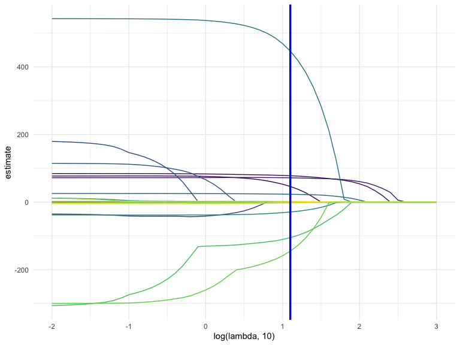
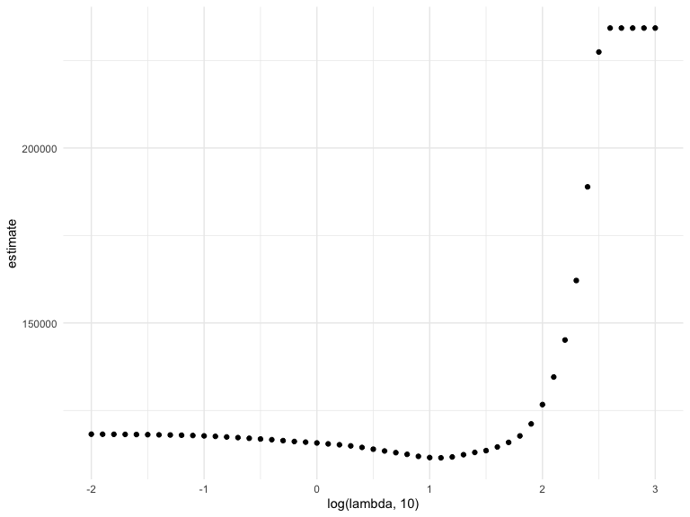

Statistical Learning
================
Weijia Xiong
11/26/2019

## Learning … with statistics

``` r
bwt_df = 
  read_csv("./data/birthweight.csv") %>% 
  janitor::clean_names() %>%
  mutate(
    babysex = as.factor(babysex),
    babysex = fct_recode(babysex, "male" = "1", "female" = "2"),
    frace = as.factor(frace),
    frace = fct_recode(frace, "white" = "1", "black" = "2", "asian" = "3", 
                       "puerto rican" = "4", "other" = "8"),
    malform = as.logical(malform),
    mrace = as.factor(mrace),
    mrace = fct_recode(mrace, "white" = "1", "black" = "2", "asian" = "3", 
                       "puerto rican" = "4")) %>% 
  sample_n(200)
```

    ## Parsed with column specification:
    ## cols(
    ##   .default = col_double()
    ## )

    ## See spec(...) for full column specifications.

### Lasso

``` r
x = model.matrix(bwt ~ ., bwt_df)[,-1]  ### by expanding factors to a set of dummy variables (depending on the contrasts) and expanding interactions similarly.


## frace use white as reference 
## mutate(frace=relevel(factor(frace),ref="white"))
y = bwt_df$bwt
```

``` r
lambda = 10^(seq(3, -2, -0.1))

lasso_fit =
  glmnet(x, y, lambda = lambda)

lasso_cv =
  cv.glmnet(x, y, lambda = lambda)  # 10-folds

lambda_opt = lasso_cv$lambda.min
```

lambda large - small: nothing in model to everything in model.

``` r
broom::tidy(lasso_fit) %>% 
  select(term, lambda, estimate) %>% 
  complete(term, lambda, fill = list(estimate = 0) ) %>% 
  filter(term != "(Intercept)") %>% 
  ggplot(aes(x = log(lambda, 10), y = estimate, group = term, color = term)) + 
  geom_path() + 
  geom_vline(xintercept = log(lambda_opt, 10), color = "blue", size = 1.2) +
  theme(legend.position = "none")
```



``` r
broom::tidy(lasso_cv) %>% 
  ggplot(aes(x = log(lambda, 10), y = estimate)) + 
  geom_point()  
```


